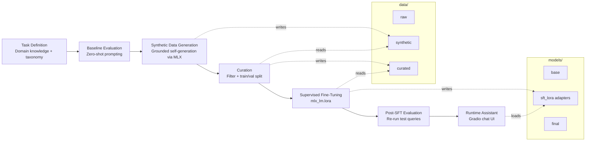
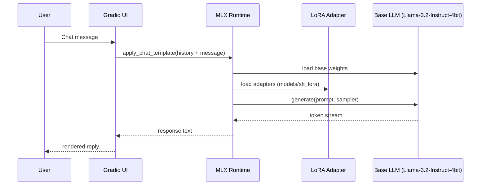

# ☕ EcoBrew LLM Assistant

An end-to-end pipeline for customizing a small open-weight LLM into a domain assistant for the **EcoBrew Smart Coffee Maker** (a fictitious product used as a training case). The workflow follows NVIDIA's *"Adding New Knowledge to Existing LLMs"* pattern — task definition, baseline evaluation, synthetic data generation, curation, LoRA supervised fine-tuning, and evaluation — implemented with **Apple MLX** for local training/inference on Apple Silicon (M-series).

## Pipeline overview



**Phases:**

1. **Task Definition** — domain knowledge, taxonomy (Brewing, Maintenance, Troubleshooting, Smart Features), and success criteria.
2. **Baseline Evaluation** — probe the un-tuned base model against representative queries to establish a starting point.
3. **Synthetic Data Generation (SDG)** — the base model generates grounded Q&A pairs constrained to the verified product knowledge, avoiding hallucination.
4. **Curation** — filter low-quality generations and split into train/validation sets formatted as MLX chat-style JSONL.
5. **Supervised Fine-Tuning (SFT)** — LoRA fine-tuning via `mlx_lm.lora`, producing adapter checkpoints.
6. **Evaluation** — re-run the same baseline queries through the fine-tuned model to compare behavior.
7. **Runtime Assistant** — a Gradio chat app serves the base model + LoRA adapters for interactive use.

## Runtime architecture



## Project structure

```
.
├── main.py                    # Entry point stub
├── pyproject.toml             # Dependencies (mlx, mlx-lm, transformers, peft, trl, gradio, ...)
├── notebooks/
│   ├── EcoBrew_LLM_Customization_Apple_M5_Pro.ipynb   # Full pipeline (3B model)
│   └── EcoBrew_LLM_Assistant_M5_Pro.ipynb             # Lighter pipeline + Gradio app (1B model)
├── data/
│   ├── raw/                   # Source material (empty by default)
│   ├── synthetic/              # Model-generated Q&A pairs (ecobrew_synthetic.jsonl)
│   ├── curated/                # Filtered + split chat-format JSONL (train.jsonl, valid.jsonl)
│   ├── train/ , val/           # Reserved for alternate split layouts
├── models/
│   ├── base/                   # Reserved for cached base weights
│   ├── sft_lora/               # LoRA adapter checkpoints + adapter_config.json
│   └── final/                  # Reserved for merged/exported models
└── configs/                    # Reserved for training/eval configs
```

## Models

| Notebook | Base model | Purpose |
|---|---|---|
| `EcoBrew_LLM_Customization_Apple_M5_Pro.ipynb` | `mlx-community/Llama-3.2-3B-Instruct-4bit` | Full pipeline, higher quality |
| `EcoBrew_LLM_Assistant_M5_Pro.ipynb` | `mlx-community/Llama-3.2-1B-Instruct-4bit` | Faster iteration, includes minimal Gradio demo |

LoRA fine-tuning config (`models/sft_lora/adapter_config.json`): rank 8, 16 tuned layers, 800 iterations, batch size 8, Adam optimizer, prompt masking enabled.

## Getting started

This project uses [uv](https://docs.astral.sh/uv/) for dependency management and requires Python 3.14 (Apple Silicon recommended for MLX).

```bash
# Install dependencies
uv sync

# Launch a notebook
uv run jupyter lab notebooks/EcoBrew_LLM_Customization_Apple_M5_Pro.ipynb
```

### Running the pipeline

Work through the notebook top to bottom: task definition → baseline eval → synthetic data generation → curation. Then run LoRA fine-tuning from the terminal:

```bash
uv run python -m mlx_lm.lora \
  --model mlx-community/Llama-3.2-3B-Instruct-4bit \
  --train \
  --data data/curated \
  --batch-size 8 \
  --lora-layers 16 \
  --iters 800 \
  --use-chat-template True \
  --mask-prompt \
  --steps-per-report 5 \
  --steps-per-eval 50 \
  --adapter-path models/sft_lora
```

Then continue in the notebook to re-evaluate the fine-tuned model and launch the Gradio assistant.

## Notes

- All generated data and model artifacts are kept under `data/` and `models/` at the project root, regardless of which notebook produced them.
- Synthetic data generation is *grounded*: the generator model is constrained to a fixed knowledge block to keep training data on-brand and reduce hallucination before it ever reaches curation.
