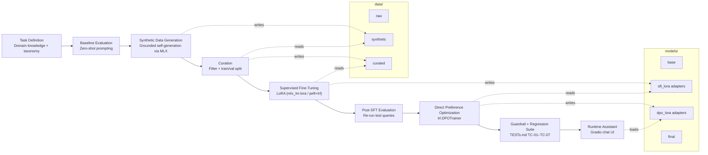
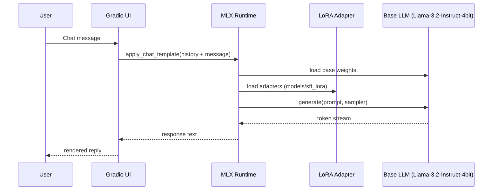

# ☕ EcoBrew LLM Assistant

An end-to-end pipeline for customizing a small open-weight LLM into a domain assistant for the **EcoBrew Smart Coffee Maker** (a fictitious product used as a training case). The workflow follows NVIDIA's *"Adding New Knowledge to Existing LLMs"* pattern — task definition, baseline evaluation, synthetic data generation, curation, LoRA supervised fine-tuning, direct preference optimization, and evaluation — implemented with **Apple MLX** (SDG/baseline) and **Hugging Face `transformers`/`peft`/`trl`** (SFT/DPO training + serving) for local training/inference on Apple Silicon (M-series).

There are two notebooks (see [Models](#models) below): `EcoBrew_LLM_Customization_Apple_M5_Pro.ipynb` runs the full MLX-native pipeline plus a side-by-side SFT/DPO adapter comparison, and `EcoBrew_LLM_Assistant_M5Pro.ipynb` is the more developed pipeline — SFT, DPO, a hardened guardrail layer, a `TESTs.md`-driven regression suite, and a served Gradio chat app.

## Pipeline overview



**Phases:**

1. **Task Definition** — domain knowledge, taxonomy (Brewing, Maintenance, Troubleshooting, Smart Features), and success criteria.
2. **Baseline Evaluation** — probe the un-tuned base model against representative queries to establish a starting point.
3. **Synthetic Data Generation (SDG)** — the base model generates grounded Q&A pairs constrained to the verified product knowledge, avoiding hallucination.
4. **Curation** — filter low-quality generations and split into train/validation sets formatted as chat-style JSONL.
5. **Supervised Fine-Tuning (SFT)** — LoRA fine-tuning (`mlx_lm.lora` in the Customization notebook, `peft`+`trl.SFTTrainer` in the Assistant notebook), producing adapter checkpoints. The Assistant notebook's fact rows are trained in *two* system-prompt conditions — no system prompt, and the production `SYSTEM_PROMPT_SERVE` — since training facts under only the former was found to cause outright fabrication (not just terser answers) once served under the latter.
6. **Evaluation** — re-run the same baseline queries through the fine-tuned model to compare behavior, including a recall/abstain/general/guardrail hit-rate harness (checked under both `SYSTEM_PROMPT_EVAL` and `SYSTEM_PROMPT_SERVE` in the Assistant notebook, since the two can diverge sharply) and a precision/recall/F1 metric on the should-answer-vs-should-refuse decision.
7. **Direct Preference Optimization (DPO)** — `trl.DPOTrainer` on top of the SFT adapter, trained on chosen/rejected pairs (recall confidence, anti-confusion, anti-fabrication, guardrail, direction-correction). Pair design favors diverse, high-quality `chosen` responses over piling up narrowly-targeted `rejected` contrasts for a single prompt — the latter tends to produce memorization of one phrasing rather than a generalized preference. None of these pairs may reuse a `TESTs.md` acceptance-test string verbatim (enforced by an `assert` guard in the Assistant notebook) — training on the literal held-out test query defeats it as a generalization check.
8. **Guardrail + Regression Suite** — deterministic pre/post-generation filters (temperature range, off-topic keywords, code/JSON leaks) plus the `TESTs.md` manual acceptance suite (TC-01–TC-07), logged to `v2_regression_log_*.csv`.
9. **Runtime Assistant** — a Gradio chat app serves the SFT/DPO LoRA adapters for interactive use.

## Runtime architecture

The Customization notebook serves entirely on **MLX** (base weights + `sft_lora` adapter):



The Assistant notebook (`EcoBrew_LLM_Assistant_M5Pro.ipynb`) instead serves via **Hugging Face `transformers`/`peft`** on `mps`, loading the `dpo_lora` adapter over the base model, and runs a deterministic guardrail layer (`check_temperature_guardrail`, off-topic keyword pre-filter, code/JSON-leak post-filter in `ecobrew_assistant`) around generation before handing off to its own Gradio chat app on port 7861.

## Project structure

```
.
├── main.py                    # Entry point stub
├── pyproject.toml             # Dependencies (mlx, mlx-lm, transformers, peft, trl, gradio, ...)
├── README.md
├── TESTs.md                   # Manual regression/acceptance suite (TC-01–TC-07) for the served assistant
├── v2_regression_log_*.csv    # Regression suite run logs (Assistant notebook, Cell 18)
├── notebooks/
│   ├── EcoBrew_LLM_Customization_Apple_M5_Pro.ipynb   # Full MLX-native pipeline + SFT/DPO adapter comparison (3B teacher / 1B model)
│   └── EcoBrew_LLM_Assistant_M5Pro.ipynb              # SFT + DPO + guardrail + regression suite + Gradio app (1B model)
├── data/
│   ├── raw/                   # Source material (empty by default)
│   ├── synthetic/              # Model-generated Q&A pairs (Customization notebook)
│   ├── curated/                # Filtered + split chat-format JSONL (Customization notebook)
│   ├── train/ , val/           # Reserved for alternate split layouts
│   ├── dpo_train.jsonl, dpo_valid.jsonl   # Hand-authored DPO preference pairs (Customization notebook)
│   └── v2/                    # Assistant notebook's own synthetic/curated data (kept separate to avoid
│                               # colliding with the Customization notebook's MLX-format artifacts above)
├── models/
│   ├── base/                   # Reserved for cached base weights
│   ├── sft_lora/               # MLX LoRA adapter (Customization notebook)
│   ├── dpo_lora/                # MLX DPO adapter (Customization notebook)
│   ├── final/                   # Reserved for merged/exported models
│   └── v2/                    # Assistant notebook's peft-format SFT/DPO adapters + trainer checkpoints
└── configs/                    # Reserved for training/eval configs
```

## Models

| Notebook | Base / teacher model | Purpose |
|---|---|---|
| `EcoBrew_LLM_Customization_Apple_M5_Pro.ipynb` | `mlx-community/Llama-3.2-1B-Instruct-4bit` (teacher: 3B-Instruct-4bit) | Full MLX-native pipeline; one cell loads `sft_lora` and `dpo_lora` side by side for direct comparison |
| `EcoBrew_LLM_Assistant_M5Pro.ipynb` | `mlx-community/Llama-3.2-1B-Instruct-4bit` (baseline eval) / `unsloth/Llama-3.2-1B-Instruct` (peft/trl SFT+DPO+serving) | SFT → DPO → guardrail → regression suite → served Gradio chat, with a precision/recall/F1 eval comparing SFT vs. DPO on the should-answer-vs-should-refuse decision |

LoRA fine-tuning config (`models/sft_lora/adapter_config.json`, Customization notebook, MLX): rank 8, 16 tuned layers, 800 iterations, batch size 8, Adam optimizer, prompt masking enabled. The Assistant notebook's `peft` LoRA config differs (rank 16, `lora_alpha=16`, `trl.SFTTrainer`); see Cell 10 of that notebook.

## Getting started

This project uses [uv](https://docs.astral.sh/uv/) for dependency management and requires Python 3.14 (Apple Silicon recommended for MLX).

```bash
# Install dependencies
uv sync

# Launch either notebook
uv run jupyter lab notebooks/EcoBrew_LLM_Customization_Apple_M5_Pro.ipynb
uv run jupyter lab notebooks/EcoBrew_LLM_Assistant_M5Pro.ipynb
```

### Running the pipeline

**Customization notebook:** work through top to bottom — task definition → baseline eval → synthetic data generation → curation. Then run LoRA fine-tuning from the terminal:

```bash
uv run python -m mlx_lm.lora \
  --model mlx-community/Llama-3.2-3B-Instruct-4bit \
  --train \
  --data data/curated \
  --batch-size 8 \
  --lora-layers 16 \
  --iters 800 \
  --use-chat-template True \
  --mask-prompt \
  --steps-per-report 5 \
  --steps-per-eval 50 \
  --adapter-path models/sft_lora
```

Then continue in the notebook for DPO training, the side-by-side SFT/DPO adapter comparison cell, and to launch the Gradio assistant.

**Assistant notebook:** work through top to bottom — task definition → baseline eval → SDG/curation → SFT (`peft`+`trl.SFTTrainer`) → SFT evaluation → DPO (`trl.DPOTrainer`) → DPO evaluation + guardrail check → the precision/recall/F1 refuse-vs-answer eval → the hardened `ecobrew_assistant` + `TESTs.md` regression suite → the served Gradio chat app (port 7861). Everything (including model loading and training) runs inline in the notebook — there's no separate CLI training step here.

## Notes

- All generated data and model artifacts are kept under `data/` and `models/` at the project root, regardless of which notebook produced them; the two notebooks use separate sub-namespaces (see [Project structure](#project-structure)) so they don't overwrite each other's artifacts.
- Synthetic data generation is *grounded*: the generator model is constrained to a fixed knowledge block to keep training data on-brand and reduce hallucination before it ever reaches curation.
- The Assistant notebook's own "Known Limitations" cell (end of the notebook) documents the current, still-evolving state of its guardrail/abstain behavior in detail — check it before trusting any single regression run or eval number at face value.
- **Don't trust a single recall/guardrail number at face value.** The Assistant notebook's SFT/DPO stages train under different system-prompt conditions than a naive eval might assume; a good score under `SYSTEM_PROMPT_EVAL` does not guarantee the same behavior in production under `SYSTEM_PROMPT_SERVE` (Cells 12/15 check both). Similarly, `TESTs.md`'s acceptance strings are asserted (Cells 1/9/13) to never appear verbatim in training data — if that guard ever fires, training data has regressed to memorizing the test rather than generalizing to it.
